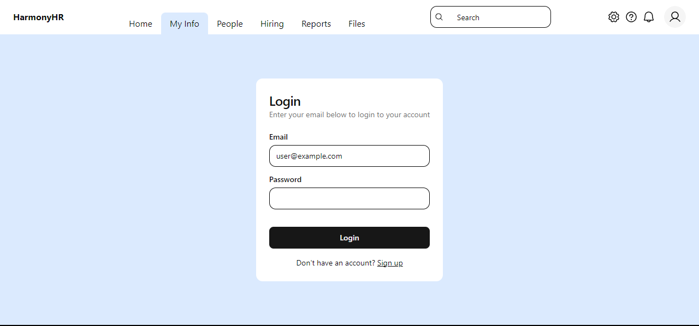

# HR Tech Frontend Example
An HR tech frontend app featuring authorization and data fetching.


*Login page (mobile)*



*Login page (desktop)*


*Time off page (mobile)*


*Time off page (desktop)*

Stack:
- Next.js
- Apollo Client
- Zustand
- TailwindCSS

The available routes are:
- `/login` (public)
- `/profile/time-off` (private)

## Development
The following tools are necessary:
- `git`
- `node`
- `npm`

To install locally, run:
```sh
git clone https://github.com/n977/hr-tech
npm i
```

To start the development server, run:
```sh
npm run dev
```
